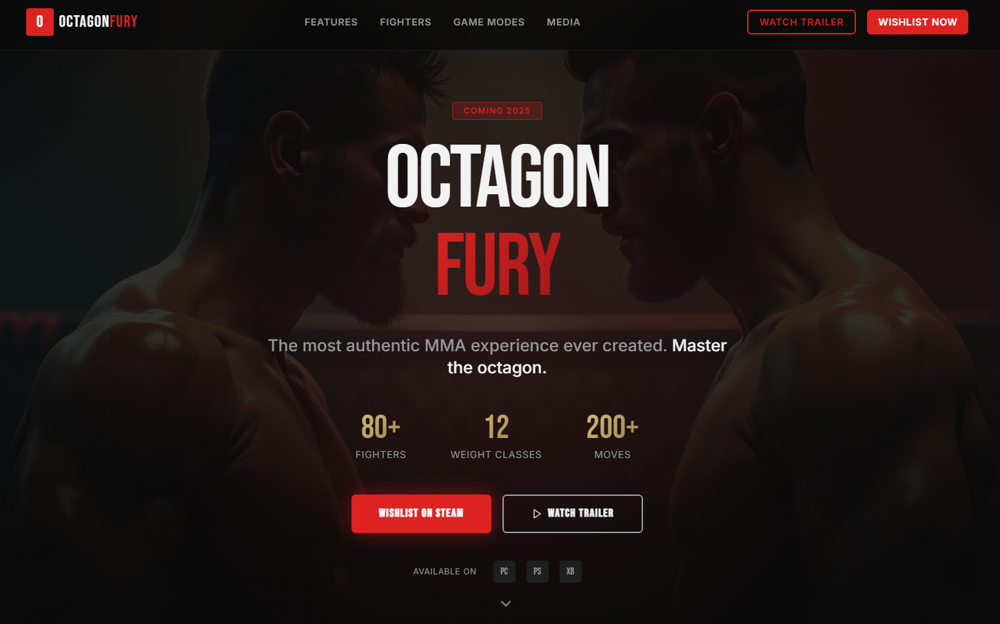

# 🎮 Octagon Fury - MMA Gaming Website

## 🖼️ Website Preview

## 🎨 Awesome Animations & Visual Effects

### ✨ Hero Section Animations
- **Slide-up animations** for staggered content reveal
- **Pulse glow effects** on call-to-action buttons
- **Gradient text animations** with red/gold color transitions
- **Bounce scroll indicators** that invite exploration

### 🌈 Gradient & Color Effects
- **Dynamic background gradients** that shift smoothly
- **Red accent glows** creating dramatic lighting
- **Gold text gradients** for premium feel
- **Cage pattern overlays** for authentic MMA atmosphere

### 🎯 Interactive UI Elements
- **Hover animations** on buttons and navigation
- **Scale transformations** on icon interactions
- **Smooth transitions** between states
- **Backdrop blur effects** for modern glassmorphism

### 📱 Responsive Animations
- **Mobile menu fade-ins** with smooth transitions
- **Touch-friendly hover states** on mobile devices
- **Adaptive animations** that work on all screen sizes
- **Performance-optimized effects** for 60fps smoothness

## 🚀 Modern Tech Stack

**Core Technologies:**
- Vite for blazing fast development
- React for component-based architecture
- TypeScript for type-safe code
- shadcn/ui for beautiful components
- Tailwind CSS for utility-first styling

**Animation Libraries:**
- Framer Motion for fluid animations
- CSS animations for performance
- Radix UI for accessible primitives

## 🎮 Game Showcase Features

**Immersive Hero Experience:**
- Full-screen fighter backgrounds
- Animated statistics counters
- Platform availability indicators
- Cinematic lighting effects

**Interactive Sections:**
- Smooth scroll animations
- Parallax effects
- Hover-reveal content
- Dynamic content transitions

## 💡 Visual Design Highlights

**Typography:**
- Bold display fonts for impact
- Gradient text effects
- Responsive font scaling
- Custom letter spacing

**Color Scheme:**
- Red & gold MMA theme
- Dark mode optimized
- High contrast for readability
- Brand-consistent palette

**Layout:**
- Full-width hero sections
- Container-based content
- Responsive grid systems
- Mobile-first design

**Master the octagon. Coming 2025.** 🥊
